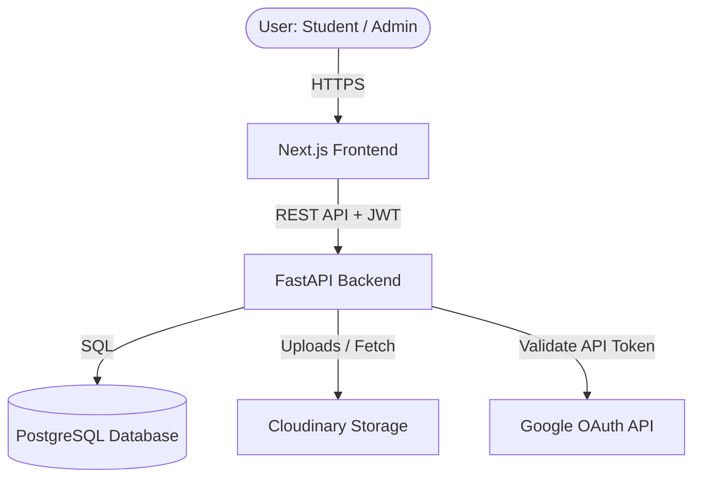
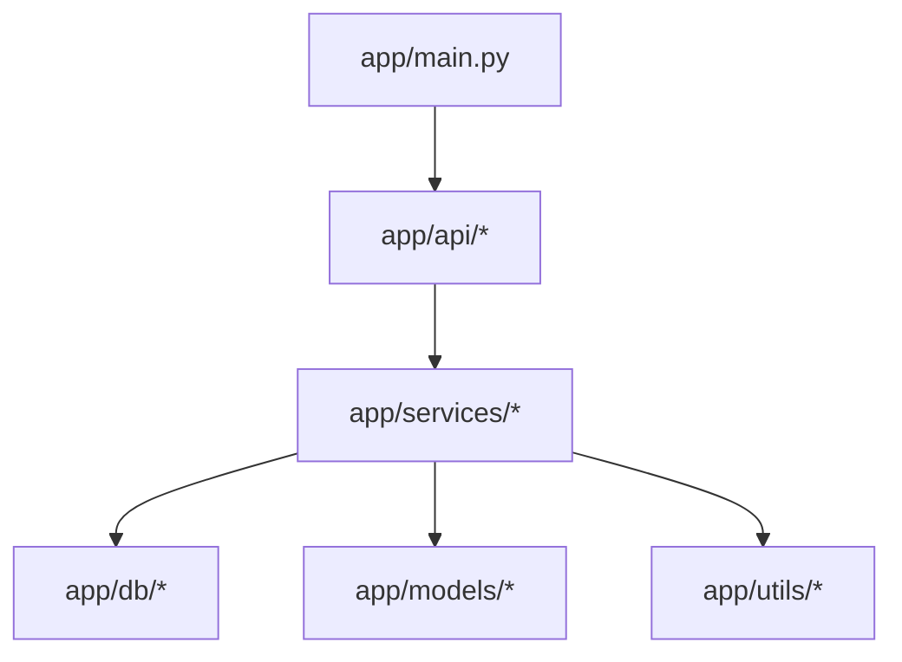
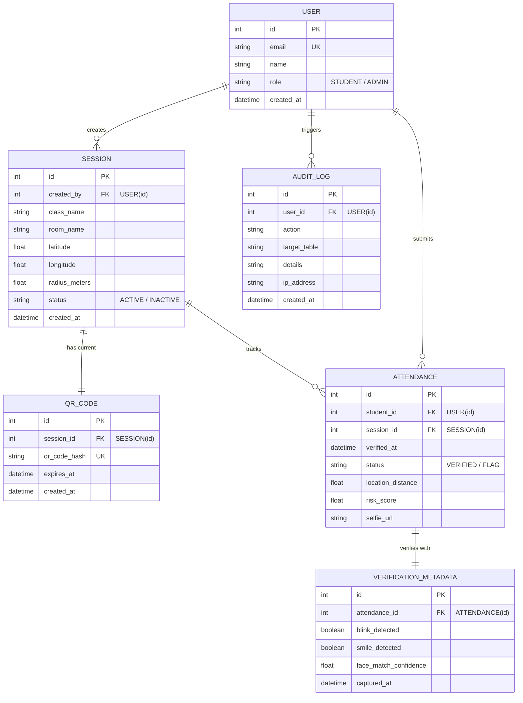

# System Architecture & Database Schema

This document details the system architecture, module relationships, and database schema for the **Smart Attendance Verification System**.

---

## 1. High-Level System Architecture

The application is structured as a decoupled SPA (Single Page Application) frontend communicating with a stateless RESTful FastAPI backend. PostgreSQL is used for data persistence, while Cloudinary stores student selfie verification images.

### Module Dependency Map

---

## 2. Database Schema (Entity Relationship Diagram)

The database schema manages users, classes, daily sessions, active QR codes, geo-fencing location validation, camera verification metadata, and audit logging.

---

## 3. Data Flow Descriptions

### A. Authentication Flow
1. User logs in via Google Single Sign-On on the Next.js Frontend.
2. Next.js receives a Google ID Token and sends it to `POST /auth/google`.
3. Backend validates the token against Google APIs and checks the domain.
4. User record is created (with Admin role if email matches `ADMIN_EMAIL`).
5. Backend issues a secure JSON Web Token (JWT) returnable to the frontend.

### B. Attendance Submission & Verification Flow
1. **QR Scanning**: Student scans the dynamic QR code containing a secure cryptographic hash.
2. **Location Check**: Frontend sends current GPS coordinates to `POST /verification/location` which checks if coordinates are within the session radius.
3. **Face Liveness / Camera Check**: Student captures a selfie. Frontend detects blink/smile features to verify liveness.
4. **Selfie Upload**: Image is uploaded securely to Cloudinary.
5. **Marking Attendance**: Frontend posts selfie metadata, session ID, and verification tokens to `POST /attendance/submit`.
6. **Risk Engine**: Backend assesses GPS distance, selfie metadata, and session status to assign a Risk Score (Low/Medium/High) and writes to audit logs.
